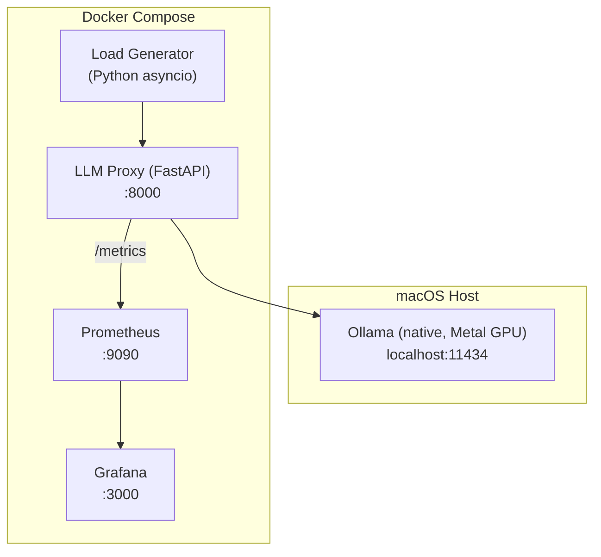
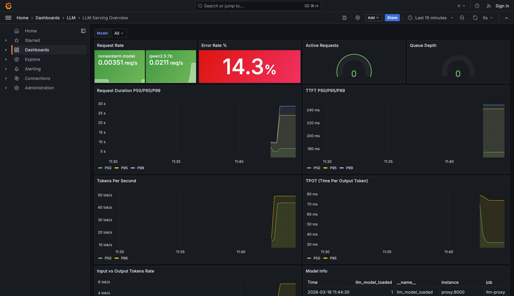
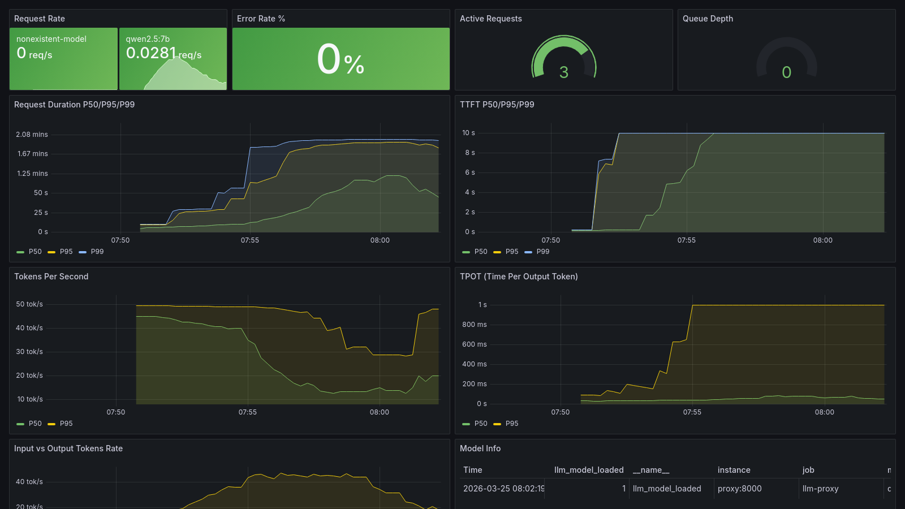
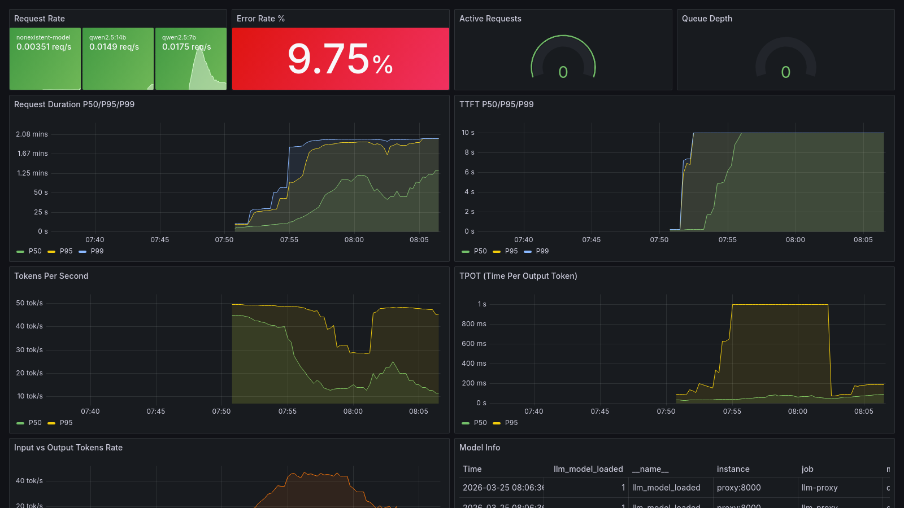

# LLM Serving Observability

LLM 서빙의 관측 가능성(Observability)을 구축하는 프로젝트입니다. Ollama 기반 LLM 서빙에 Prometheus 메트릭 계측과 Grafana 대시보드를 구현합니다.

## 아키텍처



**LLM Proxy**가 Ollama 앞단에서 요청을 중계하며, TTFT, TPS, 레이턴시 등 LLM 서빙 고유 메트릭을 Prometheus로 노출합니다.

## LLM 서빙 메트릭

| 메트릭 | Type | 설명 |
|--------|------|------|
| `llm_request_duration_seconds` | Histogram | E2E 요청 처리 시간 (P50/P95/P99) |
| `llm_ttft_seconds` | Histogram | Time to First Token |
| `llm_tokens_per_second` | Histogram | 출력 토큰 생성 속도 |
| `llm_time_per_output_token_seconds` | Histogram | Time Per Output Token (TPOT) |
| `llm_input_tokens_total` | Counter | 누적 입력 토큰 수 |
| `llm_output_tokens_total` | Counter | 누적 출력 토큰 수 |
| `llm_requests_total` | Counter | 요청 수 (model, status, stream 레이블) |
| `llm_request_errors_total` | Counter | 에러 요청 수 |
| `llm_active_requests` | Gauge | 현재 처리 중 요청 수 |
| `llm_queue_depth` | Gauge | 대기 중 요청 수 |
| `llm_model_loaded` | Gauge | 로드된 모델 정보 |

## 빠른 시작

### 1. 클론 및 설정

```bash
git clone https://github.com/DvwN-Lee/obLLMa.git
cd obLLMa
cp .env.example .env  # 필요시 OLLAMA_BASE_URL 수정
```

### 2. 스택 시작

```bash
docker compose up -d
```

전체 스택 기동: Ollama, LLM Proxy, Prometheus, Grafana

### 3. 모델 Pull

```bash
# Docker Ollama 사용 시
docker compose exec ollama ollama pull qwen2.5:7b

# Native Ollama (Metal GPU) 사용 시
# .env에서 OLLAMA_BASE_URL=http://host.docker.internal:11434 설정 후
ollama pull qwen2.5:7b
```

### 4. 동작 확인

```bash
# Proxy 헬스체크
curl http://localhost:8000/health

# 테스트 요청
curl http://localhost:8000/v1/chat/completions \
  -H "Content-Type: application/json" \
  -d '{"model": "qwen2.5:7b", "messages": [{"role": "user", "content": "Hello"}], "stream": false}'

# 메트릭 확인
curl http://localhost:8000/metrics
```

### 5. 부하 테스트 실행

```bash
cd loadtest
pip install -r requirements.txt
python run.py --scenario s1 --base-url http://localhost:8000
```

## Grafana 대시보드

`http://localhost:3000` 에 접속하면 LLM Serving Overview 대시보드가 자동 프로비저닝됩니다.

> 메트릭 수집 아키텍처, 패널 해석, 알림 대응, 운영 가이드는 [모니터링 가이드](docs/monitoring-guide.md)를 참조하세요.

| Baseline (전체 메트릭) | Peak Load (Active Requests) | Model Comparison (7b vs 14b) |
|:-------:|:-------:|:-------:|
|  |  |  |

### 대시보드 패널

| 패널 | 설명 |
|------|------|
| Request Rate | 초당 요청 수 (모델별) |
| Error Rate % | 에러율 퍼센트 |
| Active Requests | 현재 처리 중인 요청 게이지 |
| Queue Depth | 대기 중인 요청 게이지 |
| Request Duration P50/P95/P99 | E2E 레이턴시 분포 |
| TTFT P50/P95/P99 | 첫 토큰까지 시간 분포 |
| Tokens Per Second | 토큰 생성 속도 |
| TPOT | 토큰당 생성 시간 |
| Input vs Output Tokens | 입출력 토큰 처리량 |
| Model Info | 로드된 모델 상태 |

## 부하 테스트 시나리오

| 시나리오 | 설명 | 동시성 | 요청 수 | 예상 소요 (Docker CPU) |
|----------|------|:------:|:------:|:---------------------:|
| `s1` | Baseline: 단일 요청 레이턴시 | 1 | 5 | ~2.5분 |
| `s-demo` | Demo: Queuing 효과 경량 시연 | 2 | 6 | ~5분 |
| `s2` | Concurrency Sweep: 1→16 동시 요청 | 1~16 | 25 | ~40분+ |
| `s3` | Sustained Load: 혼합 프롬프트 | 4 | 20 | ~28분 |
| `s4` | Variable Prompt: 프롬프트 길이별 비교 | 4 | 15 | ~20분+ |
| `s5` | Model Comparison: 모델별 성능 비교 | 4 | 10 | 모델별 상이 |

> S5는 qwen2.5:14b 사전 설치 필요 (`ollama pull qwen2.5:14b`). 미설치 모델은 자동 스킵됩니다.
> 소요시간은 Docker Desktop CPU 모드 기준. Native Metal GPU는 3~5x 빠를 수 있습니다.

```bash
python run.py --scenario s1 --base-url http://localhost:8000
```

### 추천 데모 순서 (~10분)

1. `python run.py --scenario s1` — Baseline 확인 (~2.5분)
2. Grafana(`localhost:3000`) → 대시보드 부하 전 상태 관찰
3. `python run.py --scenario s-demo` — Queuing 효과 관찰 (~5분)
4. Grafana → TTFT 악화, Queue Depth 증가 확인

## 벤치마크 결과

qwen2.5:7b (Q4_K_M), Apple Silicon Docker Desktop (CPU mode):

| 시나리오 | TTFT P50 | TPS Avg | Duration P50 | 에러 |
|----------|----------|---------|--------------|------|
| S1 Baseline (동시 1) | 0.8s | 9.8 tok/s | 33.1s | 0% |
| S3 Sustained (동시 4, 20건) | 161.1s | 3.0 tok/s | 292.6s | 0% |

**핵심 인사이트**: 부하 시 TTFT는 ~264x 악화(0.8s → 212s)되지만 TPS는 3x만 하락한다 — TTFT는 처리량만으로는 보이지 않는 Queuing 효과를 포착하는 Canary 메트릭이다.

전체 데이터와 분석은 [benchmarks/results.md](benchmarks/results.md) 참조.

## 기술 스택

| 구성 요소 | 기술 |
|----------|------|
| LLM 서빙 | Ollama (Apple Silicon Metal) |
| Proxy | FastAPI + prometheus_client |
| 모니터링 | Prometheus + Grafana |
| 부하 테스트 | Python asyncio + httpx |
| 인프라 | Docker Compose |

## 프로젝트 구조

```
├── docker-compose.yml
├── .env.example              # 환경변수 기본값
├── proxy/
│   ├── main.py              # FastAPI Proxy + Streaming 파이프라인
│   ├── metrics.py            # Prometheus 메트릭 정의 (SSOT)
│   ├── config.py             # 환경변수 로딩
│   ├── Dockerfile
│   └── requirements.txt
├── prometheus/
│   └── prometheus.yml        # 스크래핑 설정
├── grafana/
│   ├── provisioning/         # 자동 프로비저닝 설정
│   └── dashboards/
│       └── llm-overview.json # Grafana 대시보드
├── loadtest/
│   ├── run.py               # CLI 부하 테스트 도구
│   ├── scenarios.py         # S1~S5 시나리오 정의
│   ├── requirements.txt     # httpx, asyncio
│   └── DEMO-SCENARIO.md     # 데모 가이드
└── benchmarks/              # 벤치마크 결과
```
