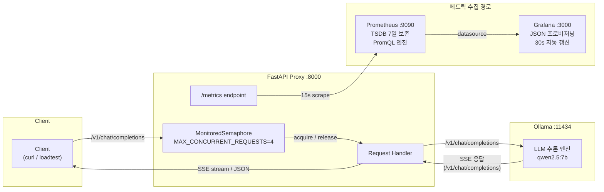

# LLM Serving Observability — 모니터링 가이드

> **대상 독자**: 이 프로젝트를 처음 접하는 개발자, 포트폴리오 리뷰어
> **환경**: Ollama + FastAPI Proxy + Prometheus + Grafana (Docker Compose)
> **메트릭 SSOT(Single Source of Truth, 단일 진실 공급원)**: `proxy/metrics.py`

---

## Introduction

이 가이드는 LLM(Large Language Model) 서빙 환경에서 **무엇을 관측해야 하는지**, **이상 징후를 어떻게 진단하는지**, **대시보드를 어떻게 운영하는지** 설명한다. Ollama 기반 로컬 추론 환경에서 11개 핵심 메트릭을 수집·시각화하는 전체 파이프라인을 다룬다.

## 목차

1. [메트릭 수집 아키텍처](#1-메트릭-수집-아키텍처)
2. [메트릭 해석 가이드](#2-메트릭-해석-가이드)
3. [알림 및 대응 가이드](#3-알림-및-대응-가이드)
4. [운영 가이드](#4-운영-가이드)

---

## 1. 메트릭 수집 아키텍처

### 1.1 전체 데이터 흐름



**Proxy 내부 계측 포인트**:

| 계측 시점 | 기록 메트릭 |
|----------|-----------|
| 세마포어 acquire/release | `llm_active_requests`, `llm_queue_depth` |
| 첫 토큰 도착 | `llm_ttft_seconds` |
| 응답 완료 | `llm_request_duration_seconds`, `llm_tokens_per_second`, `llm_time_per_output_token_seconds` |
| 토큰 카운트 | `llm_input_tokens_total`, `llm_output_tokens_total` |
| 요청 결과 | `llm_requests_total`, `llm_request_errors_total` |
| 30s 폴링 | `llm_model_loaded` |

> **용어**: SSE(Server-Sent Events)는 HTTP 기반 단방향 이벤트 스트림 프로토콜이다. NDJSON(Newline-Delimited JSON)은 줄 단위로 구분된 JSON 형식이다. Ollama의 네이티브 API(`/api/chat`)는 NDJSON을, OpenAI 호환 API(`/v1/chat/completions`)는 SSE를 사용한다.

### 1.2 각 컴포넌트의 역할

| 컴포넌트 | 역할 | 포트 |
|---------|------|------|
| **Ollama** | LLM 추론 엔진. `qwen2.5:7b` 등 모델을 로컬에서 실행. OpenAI 호환 API(`/v1/chat/completions`) 사용 시 SSE, 네이티브 API(`/api/chat`) 사용 시 NDJSON으로 토큰을 순차 반환. | 11434 |
| **FastAPI Proxy** | 계측(Instrumentation) 레이어. OpenAI API 형식(`/v1/chat/completions`)을 받아 Ollama로 프록시하면서 모든 메트릭을 수집. | 8000 |
| **Prometheus** | TSDB(Time Series Database). 15초마다 Proxy의 `/metrics` 엔드포인트를 스크래핑하여 저장. 7일 보존. | 9090 |
| **Grafana** | 시각화 레이어. `grafana/dashboards/*.json`으로 대시보드를 자동 프로비저닝. 30초마다 갱신. | 3000 |

### 1.3 MonitoredSemaphore — Active Requests / Queue Depth 동작 원리

Proxy는 동시 Ollama 요청 수를 `MAX_CONCURRENT_REQUESTS`(기본값: **4**)로 제한한다. 이 제한을 구현하는 `MonitoredSemaphore`가 Active Requests(`llm_active_requests`)/Queue Depth(`llm_queue_depth`) 메트릭의 유일한 업데이트 지점이다.

```
요청 도착
    │
    ▼
acquire() 호출
    ├─ QUEUE_DEPTH += 1          ← 대기 시작 (M10)
    │
    ├─ [세마포어 슬롯 대기 중...]
    │
    ├─ 슬롯 획득 성공
    │   ├─ QUEUE_DEPTH -= 1      ← 대기 종료 (M10)
    │   └─ ACTIVE_REQUESTS += 1  ← 처리 시작 (M9)
    │
    ▼
요청 처리 (Ollama 호출)
    │
    ▼
release() 호출
    └─ ACTIVE_REQUESTS -= 1      ← 처리 완료 (M9)
       세마포어 슬롯 반환
```

**스트리밍 요청의 특수성**: 스트리밍 응답의 경우 세마포어를 `StreamingResponse` 생성 시점이 아닌, 스트림이 완전히 완료된 후(`event_generator()` 종료 시) 해제한다. 이를 통해 스트리밍 도중 새 요청이 세마포어 슬롯을 선점하는 것을 방지한다.

### 1.4 Scrape Interval 15s의 함의

Prometheus는 15초마다 메트릭을 수집(`scrape_interval: 15s`, `evaluation_interval: 15s`)한다.

- **단기 스파이크 감지 한계**: 15초 미만의 순간적인 급증(예: 1초간 집중된 에러)은 단일 스크래핑 포인트에 희석되어 보이지 않을 수 있다.
- **PromQL rate() 윈도우**: 대시보드 패널은 `[5m]` 윈도우를 사용한다. 15s 간격 대비 최소 4배 이상이므로 충분한 데이터 포인트를 확보한다.
- **Grafana 갱신 주기**: 대시보드는 30초마다 갱신되므로 실시간성은 Prometheus scrape보다 한 주기 뒤처질 수 있다.

---

## 2. 메트릭 해석 가이드

> 모든 메트릭은 `proxy/metrics.py`에서 단일 정의된다 (Constitution #2 — Metrics SSOT).

### PromQL 기초

PromQL(Prometheus Query Language)은 Prometheus에 저장된 시계열 데이터를 조회하는 쿼리 언어다.

| 함수 | 설명 |
|------|------|
| `rate(metric[5m])` | 5분 윈도우에서 초당 평균 변화율. Counter 메트릭에 사용 |
| `histogram_quantile(0.95, ...)` | Histogram 분포에서 95번째 백분위수(P95) 추출. 상위 5%를 제외한 최대값 |
| `sum by (label) (...)` | 지정한 레이블별로 시계열을 합산 |
| `$model` | Grafana 대시보드 변수. 드롭다운에서 선택한 모델명으로 필터링 |

### Prometheus 메트릭 타입

| 타입 | 설명 | 예시 |
|------|------|------|
| **Counter** | 단조 증가하는 누적 값. 재시작 시 0으로 초기화. `rate()`로 초당 변화율 계산에 사용 | `llm_requests_total` |
| **Gauge** | 현재 순간의 값. 증감 가능 | `llm_active_requests` |
| **Histogram** | 값의 분포를 미리 정의된 버킷으로 기록. `histogram_quantile()`로 P50/P95/P99 백분위수 계산 | `llm_request_duration_seconds` |

### 메트릭 카테고리

| 카테고리 | 메트릭 | 핵심 질문 |
|----------|--------|----------|
| **레이턴시** | M1(Duration), M2(TTFT), M4(TPOT) | "얼마나 빠른가?" |
| **처리량** | M3(TPS), M5(Input Tokens), M6(Output Tokens), M7(Requests) | "얼마나 많이 처리하는가?" |
| **안정성** | M8(Errors) | "얼마나 안정적인가?" |
| **용량** | M9(Active Requests), M10(Queue Depth) | "얼마나 여유가 있는가?" |
| **상태** | M11(Model Loaded) | "모델이 준비되어 있는가?" |

### 공통 레이블 설명

| 레이블 | 값 예시 | 설명 |
|--------|---------|------|
| `model` | `qwen2.5:7b` | 요청에 사용된 Ollama 모델 이름 |
| `status` | `success`, `error` | 요청 성공/실패 여부 |
| `stream` | `true`, `false` | 스트리밍 모드 여부 |
| `status_code` | `404`, `502` | HTTP 에러 코드 (에러 시만 존재) |
| `quantization` | `Q4_K_M`, `unknown` | 모델 양자화 레벨 |

---

### M1 — `llm_request_duration_seconds`

| 항목 | 값 |
|------|-----|
| **타입** | Histogram |
| **레이블** | `model` |
| **버킷** | 0.1, 0.25, 0.5, 1, 2.5, 5, 10, 30, 60, 120 (초) |

**측정 내용**: Client가 요청을 보낸 시점부터 Proxy가 응답을 완전히 전송한 시점까지의 E2E(End-to-End) 소요 시간. 스트리밍의 경우 `[DONE]` 청크 수신 후 기록된다.

**LLM 서빙에서의 중요성**: 사용자 체감 응답 시간 전체를 포괄하는 가장 중요한 레이턴시 지표. 프롬프트 길이, 모델 크기, 동시 요청 수, 시스템 부하에 모두 영향을 받는다.

**Grafana PromQL**:
```promql
# P50 (중앙값 — 전체 요청의 50%가 이 값 이하)
histogram_quantile(0.50, sum(rate(llm_request_duration_seconds_bucket{model=~"$model"}[5m])) by (le))

# P95 (전체 요청의 95%가 이 값 이하)
histogram_quantile(0.95, sum(rate(llm_request_duration_seconds_bucket{model=~"$model"}[5m])) by (le))

# P99 (상위 1% 느린 요청)
histogram_quantile(0.99, sum(rate(llm_request_duration_seconds_bucket{model=~"$model"}[5m])) by (le))
```

**정상/비정상 범위**:
- qwen2.5:7b 단일 요청: P50 기준 5~15초가 일반적 (프롬프트/응답 길이에 따라 상이)
- P99가 P50의 3배 이상이면 간헐적 부하 집중 의심
- P95 > 60초이면 타임아웃 위험 또는 큐 대기 과다

---

### M2 — `llm_ttft_seconds`

| 항목 | 값 |
|------|-----|
| **타입** | Histogram |
| **레이블** | `model` |
| **버킷** | 0.001~10.0초 (세밀한 하단 버킷) |

**측정 내용**: 요청 전송 후 첫 번째 토큰이 응답으로 도착하기까지의 시간(Time To First Token). **스트리밍 모드에서만 기록**된다. `choices[0].delta.content`가 처음 채워지는 청크를 감지하여 측정한다.

**LLM 서빙에서의 중요성**: 사용자가 "응답이 시작되고 있다"고 인지하는 시점을 결정한다. 스트리밍 UX에서 TTFT가 길면 화면이 멈춘 것처럼 보인다. 모델 로드 시간, KV Cache(Key-Value Cache: LLM이 이전 토큰의 어텐션 계산 결과를 재사용하여 추론 속도를 높이는 내부 캐시) 히트율, 프롬프트 처리(prefill) 속도에 영향을 받는다.

**Grafana PromQL**:
```promql
# P50
histogram_quantile(0.50, sum(rate(llm_ttft_seconds_bucket{model=~"$model"}[5m])) by (le))

# P95
histogram_quantile(0.95, sum(rate(llm_ttft_seconds_bucket{model=~"$model"}[5m])) by (le))

# P99
histogram_quantile(0.99, sum(rate(llm_ttft_seconds_bucket{model=~"$model"}[5m])) by (le))
```

**정상/비정상 범위**:
- 로컬 Ollama 환경: P50 기준 0.5~2초
- P95 > 5초이면 모델 cold-start(첫 로드 지연) 또는 동시 요청 병목 의심
- 첫 요청만 TTFT가 높으면 모델 warm-up 문제 (`OLLAMA_KEEP_ALIVE=5m`으로 완화)

---

### M3 — `llm_tokens_per_second`

| 항목 | 값 |
|------|-----|
| **타입** | Histogram |
| **레이블** | `model` |
| **버킷** | 1, 5, 10, 15, 20, 30, 40, 50, 75, 100, 150, 200, 300 (tok/s) |

**측정 내용**: 요청별 출력 토큰 생성 속도 (`output_tokens / duration`). 스트리밍과 비스트리밍 모두 응답 완료 후 기록된다.

**LLM 서빙에서의 중요성**: 모델의 추론 처리량(throughput)을 나타낸다. 동일 하드웨어에서 모델 크기, 양자화 수준, 배치 크기에 따라 크게 달라진다. 부하가 증가할수록 이 값이 낮아지면 CPU/GPU 경합을 의심해야 한다.

**Grafana PromQL**:
```promql
# P50 처리량
histogram_quantile(0.50, sum(rate(llm_tokens_per_second_bucket{model=~"$model"}[5m])) by (le))

# P95 처리량
histogram_quantile(0.95, sum(rate(llm_tokens_per_second_bucket{model=~"$model"}[5m])) by (le))
```

**정상/비정상 범위**:
- qwen2.5:7b (Q4_K_M, M4 Pro): P50 기준 20~40 tok/s
- 10 tok/s 미만이면 하드웨어 리소스 경합 또는 모델 부분 로드(CPU fallback) 의심
- 동시 요청 증가 시 tok/s 저하 폭이 크면 단일 스레드 병목 가능성

---

### M4 — `llm_time_per_output_token_seconds`

| 항목 | 값 |
|------|-----|
| **타입** | Histogram |
| **레이블** | `model` |
| **버킷** | 0.005~1.0초/token |

**측정 내용**: 출력 토큰 1개를 생성하는 데 걸리는 평균 시간 (`duration / output_tokens`). M3(TPS)의 역수이며, TPOT(Time Per Output Token)이라고도 한다.

**LLM 서빙에서의 중요성**: OpenTelemetry Semantic Conventions for Generative AI(OTel GenAI 스펙, LLM 관측 표준)에서 권장하는 LLM 서빙 핵심 지표. TPS보다 더 직관적으로 "토큰 생성 지연"을 표현한다. P95 TPOT이 높으면 일부 요청에서 심각한 생성 지연이 있음을 의미한다.

**Grafana PromQL**:
```promql
# P50
histogram_quantile(0.50, sum(rate(llm_time_per_output_token_seconds_bucket{model=~"$model"}[5m])) by (le))

# P95
histogram_quantile(0.95, sum(rate(llm_time_per_output_token_seconds_bucket{model=~"$model"}[5m])) by (le))
```

**정상/비정상 범위**:
- P50 기준 0.025~0.05초/tok (= 20~40 tok/s에 해당)
- P95 > 0.1초/tok이면 고부하 상황에서 사용자 체감 지연 발생 우려

---

### M5 — `llm_input_tokens_total`

| 항목 | 값 |
|------|-----|
| **타입** | Counter |
| **레이블** | `model` |

**측정 내용**: 모델별 누적 입력 토큰 수. Ollama가 반환하는 `usage.prompt_tokens` 값을 매 요청마다 누적한다.

**LLM 서빙에서의 중요성**: 클라우드 LLM API에서는 입력 토큰이 비용의 주요 요소다. 로컬 환경에서는 모델 prefill 부하(긴 컨텍스트 처리)를 파악하는 데 활용된다. 입력 토큰이 과도하게 크면 TTFT가 증가한다.

**Grafana PromQL**:
```promql
# 초당 입력 토큰 처리 속도 (모델별)
sum by (model) (rate(llm_input_tokens_total{model=~"$model"}[5m]))
```

**정상/비정상 범위**:
- 누적 Counter 자체보다 `rate()`로 변환한 처리 속도로 해석
- Input rate가 갑자기 급증하면 긴 프롬프트 요청이 집중되고 있는 신호

---

### M6 — `llm_output_tokens_total`

| 항목 | 값 |
|------|-----|
| **타입** | Counter |
| **레이블** | `model` |

**측정 내용**: 모델별 누적 출력 토큰 수. Ollama가 반환하는 `usage.completion_tokens` 값을 매 요청마다 누적한다.

**LLM 서빙에서의 중요성**: 출력 토큰은 실제 추론 계산량과 직결되며, M3(TPS) 산정의 기준이 된다. Input/Output 토큰 비율(`output/input ratio`)을 통해 응답 길이 패턴을 파악할 수 있다.

**Grafana PromQL**:
```promql
# 초당 출력 토큰 생성 속도 (모델별)
sum by (model) (rate(llm_output_tokens_total{model=~"$model"}[5m]))
```

**Input vs Output 비율 분석**:
```promql
# Output/Input 비율 (> 1이면 응답이 프롬프트보다 긴 경우)
sum(rate(llm_output_tokens_total[5m])) / sum(rate(llm_input_tokens_total[5m]))
```

---

### M7 — `llm_requests_total`

| 항목 | 값 |
|------|-----|
| **타입** | Counter |
| **레이블** | `model`, `status` (`success`/`error`), `stream` (`true`/`false`) |

**측정 내용**: 요청 처리 결과별 누적 카운트. 성공/에러, 스트리밍/비스트리밍 조합으로 세분화된다.

**LLM 서빙에서의 중요성**: 전체 처리량(throughput)과 스트리밍 사용 비율을 파악하는 기본 지표. Error Rate 계산의 분모로 사용된다.

**Grafana PromQL**:
```promql
# 초당 요청 처리율 (모델별)
sum by (model) (rate(llm_requests_total{model=~"$model"}[5m]))

# 에러율 % (M8과 조합)
sum(rate(llm_request_errors_total{model=~"$model"}[5m])) /
sum(rate(llm_requests_total{model=~"$model"}[5m])) * 100 or vector(0)
```

**정상/비정상 범위**:
- Error Rate < 1%: 정상
- Error Rate 1~5%: 주의 (Grafana 황색 임계값)
- Error Rate > 5%: 경보 (Grafana 적색 임계값)

---

### M8 — `llm_request_errors_total`

| 항목 | 값 |
|------|-----|
| **타입** | Counter |
| **레이블** | `model`, `status_code` (HTTP 코드 문자열) |

**측정 내용**: 에러 요청의 모델·HTTP 상태 코드별 누적 카운트. `status_code`가 없는 연결 실패는 `"502"`로 기록된다.

**LLM 서빙에서의 중요성**: 에러의 원인을 HTTP 코드로 분류해 트러블슈팅을 돕는다. `404`는 잘못된 모델 이름, `503`은 Ollama 과부하, `502`는 Proxy-Ollama 연결 실패를 의미한다.

**Grafana PromQL**:
```promql
# 에러율 (M7 분모와 함께 사용)
sum(rate(llm_request_errors_total{model=~"$model"}[5m])) /
sum(rate(llm_requests_total{model=~"$model"}[5m])) * 100 or vector(0)

# 상태 코드별 에러 추이 분석
sum by (status_code) (rate(llm_request_errors_total[5m]))
```

---

### M9 — `llm_active_requests`

| 항목 | 값 |
|------|-----|
| **타입** | Gauge |
| **레이블** | 없음 |

**측정 내용**: 현재 세마포어를 점유하고 Ollama에서 처리 중인 요청 수. `MonitoredSemaphore.acquire()` 성공 시 +1, `release()` 시 -1된다.

**LLM 서빙에서의 중요성**: 세마포어 한도(`MAX_CONCURRENT_REQUESTS=4`)와 직접 비교하여 용량 포화도를 판단한다. 이 값이 지속적으로 한도에 붙어 있으면 큐 대기(M10)가 증가하고 레이턴시가 상승한다.

**Grafana PromQL**:
```promql
llm_active_requests
```

**정상/비정상 범위**:
- 0~4: 정상 (MAX_CONCURRENT_REQUESTS 기본값 4)
- 지속적으로 4이면 용량 포화 → M10 Queue Depth도 함께 확인
- Grafana 임계값: 황색=50, 적색=100 (현재 프로젝트 기준 0~4가 정상. 임계값은 `MAX_CONCURRENT_REQUESTS` 상향 시 스케일링을 고려한 사전 설정값)

---

### M10 — `llm_queue_depth`

| 항목 | 값 |
|------|-----|
| **타입** | Gauge |
| **레이블** | 없음 |

**측정 내용**: 세마포어 슬롯 대기 중인 요청 수. `MonitoredSemaphore.acquire()` 진입 즉시 +1, 슬롯 획득 후 -1된다. 대기 없이 슬롯을 바로 얻으면 순간적으로 1→0이 되므로 스크래핑 간격에 따라 관찰되지 않을 수 있다.

**LLM 서빙에서의 중요성**: M9(Active Requests)과 함께 요청 백로그를 나타낸다. Queue Depth가 높으면 클라이언트 타임아웃 위험이 증가하며, 스케일 아웃 또는 `MAX_CONCURRENT_REQUESTS` 조정이 필요한 신호다.

**Grafana PromQL**:
```promql
llm_queue_depth
```

**정상/비정상 범위**:
- 0: 이상적 (대기 없음)
- 1~9: 주의 (황색 임계값: 10)
- 10 이상: 경보 (적색 임계값: 50)
- Queue Depth > MAX_CONCURRENT_REQUESTS 이면 심각한 병목

---

### M11 — `llm_model_loaded`

| 항목 | 값 |
|------|-----|
| **타입** | Gauge |
| **레이블** | `model`, `quantization` |

**측정 내용**: Ollama에 현재 로드된 모델 상태. Proxy 시작 후 30초 간격으로 Ollama `/api/ps`를 폴링하여 갱신된다. 로드됨=1, 언로드됨=0으로 표시된다.

**LLM 서빙에서의 중요성**: 모델이 메모리에 상주해 있는지 확인하는 상태 지표. `OLLAMA_KEEP_ALIVE=5m` 설정으로 마지막 요청 후 5분간 모델이 유지된다. 모델이 언로드된 상태에서 요청이 들어오면 cold-start가 발생하고 TTFT가 급증한다.

**Grafana PromQL**:
```promql
# 현재 로드된 모델 정보 (Table 패널, instant query)
llm_model_loaded
```

**Grafana 표시**: Model Info 패널(Table)에서 `model`, `quantization`, `Value(=1/0)` 컬럼으로 표시된다.

**정상/비정상 범위**:
- 값=1: 모델 로드 중 (정상)
- 값=0: 모델 언로드됨 (idle 상태는 정상, 요청 직전이면 cold-start 예상)
- 레이블 없음 또는 패널 공백: Ollama 연결 불가 또는 모델 미실행 상태

---

## 3. 알림 및 대응 가이드

대시보드 패널에서 이상 징후를 발견했을 때의 원인 진단과 대응 플레이북이다.

---

### 3.1 Error Rate 급등 (>5%)

**증상**

- Error Rate % 패널이 0% → 5% 이상으로 상승
- `llm_request_errors_total` Counter가 빠르게 증가

**원인 진단**

```promql
# 모델·상태코드별 에러 비율 분해
rate(llm_request_errors_total[5m])
```

| 상태 코드 | 가능한 원인 |
|-----------|------------|
| `404` | 잘못된 모델 이름 (`nonexistent-model` 등) |
| `500` / `502` | Ollama 프로세스 다운, OOM으로 인한 비정상 종료 |
| `400` | 프록시의 모델명 검증 실패 (특수문자 포함) |

**대응 절차**

1. Ollama 상태 확인:
   ```bash
   # Native Ollama
   ollama list
   curl http://localhost:11434/api/ps

   # Docker Ollama
   docker compose logs ollama --tail 50
   ```
2. `llm_model_loaded` 패널에서 모델 로드 상태(0/1) 확인
3. 모델 미로드 시 수동 pull:
   ```bash
   ollama pull qwen2.5:7b
   ```
4. OOM 의심 시 Docker 메모리 제한 확인 (`docker-compose.yml` `memory:` 설정)
5. 에러가 지속되면 프록시 재시작:
   ```bash
   docker compose restart proxy
   ```

**정상화 기준**: 5분 이동 평균 에러율 < 1%

---

### 3.2 TTFT 급격한 증가 (concurrency=1에서 >10s)

**증상**

- TTFT P50 패널이 정상 범위(Native Metal: ~0.15s, Docker CPU: ~0.75s)에서 갑자기 수초 이상으로 급등
- 단일 요청(Queue Depth=0) 상황에서도 TTFT가 높음

**원인 진단**

```promql
# TTFT 분포 (P50/P95/P99)
histogram_quantile(0.50, sum(rate(llm_ttft_seconds_bucket{model=~"$model"}[5m])) by (le))
histogram_quantile(0.95, sum(rate(llm_ttft_seconds_bucket{model=~"$model"}[5m])) by (le))
```

| 진단 | 원인 | 확인 방법 |
|------|------|----------|
| TTFT >>10s, 단일 요청 | Cold Start: KEEP_ALIVE 타임아웃 후 모델 재로드 | `llm_model_loaded` 패널이 0으로 내려간 적 있는지 확인 |
| TTFT 급등 후 정상화 | 모델 스왑 (다른 모델 로드 후 타겟 모델 재로드) | Ollama 로그에서 `loading model` 메시지 확인 |
| 지속적 TTFT 상승 | GPU/CPU 메모리 압박 (swap 발생) | `docker stats` 또는 macOS Activity Monitor 확인 |

**대응 절차**

1. 첫 요청 전 Warm-up을 반드시 실행:
   ```bash
   curl -s http://localhost:8000/v1/chat/completions \
     -H "Content-Type: application/json" \
     -d '{"model":"qwen2.5:7b","messages":[{"role":"user","content":"warmup"}],"stream":false}' > /dev/null
   ```
2. Cold Start 반복 시 `OLLAMA_KEEP_ALIVE` 값 증가 (기본값: `5m`):
   ```bash
   # .env에서 조정
   OLLAMA_KEEP_ALIVE=30m
   ```
3. 메모리 부족 시 모델 크기를 줄이거나 다른 모델 언로드:
   ```bash
   ollama stop <다른-모델>
   ```

**참고 수치 (Apple Silicon Metal GPU(macOS 전용 하드웨어 가속), S1 Baseline)**
- 정상: TTFT P50 ~ 0.15s
- Cold Start: TTFT 30s~수분 (모델 크기에 비례)

> S1~S5 시나리오 상세: [§4.2 부하 테스트 실행](#42-부하-테스트-실행) 참조

---

### 3.3 Queue Depth 지속 증가

**증상**

- Queue Depth 패널이 0에서 지속적으로 양의 값을 유지
- Active Requests가 `MAX_CONCURRENT_REQUESTS` 상한(기본값: 4)에 고정

**원인 진단**

```promql
# 현재 큐 깊이
llm_queue_depth

# 현재 활성 요청 수
llm_active_requests

# 요청 처리 속도
rate(llm_requests_total[1m])
```

| 진단 | 원인 |
|------|------|
| Queue Depth > 0, Active = MAX_CONCURRENT | 동시 요청 수 > MAX_CONCURRENT_REQUESTS |
| Active가 MAX에 고정되고 Request Rate 낮음 | 개별 요청 처리 시간이 매우 길어짐 (긴 프롬프트, 느린 모델) |

**대응 절차**

1. 요청 부하 감소 -- 클라이언트 측 동시성 제한
2. 프록시의 `MAX_CONCURRENT_REQUESTS` 상향 (단, 메모리 여유 확인 필수):
   ```bash
   # .env에서 조정
   MAX_CONCURRENT_REQUESTS=8
   docker compose restart proxy
   ```
3. 큐가 줄어들지 않으면 모델 성능 자체가 병목 -- 더 빠른 모델(소형 양자화) 검토

**S2 Concurrency Sweep 참고**: concurrency=8에서 MAX=4 상한으로 Queue Depth가 4까지 관측됨. 큐는 concurrency > MAX일 때 정상적으로 발생하는 동작이며, 지속 시간이 문제의 기준이다.

---

### 3.4 TPS 급격한 하락 (<기준치의 50%)

**증상**

- Tokens Per Second 패널이 기준치(Native Metal: ~47 tok/s, Docker CPU: ~10 tok/s)의 50% 이하로 하락

**원인 진단**

```promql
# TPS 분포 (P50)
histogram_quantile(0.50, sum(rate(llm_tokens_per_second_bucket{model=~"$model"}[5m])) by (le))

# TPOT (Token당 생성 시간) 상승 여부
histogram_quantile(0.50, sum(rate(llm_time_per_output_token_seconds_bucket{model=~"$model"}[5m])) by (le))
```

| 진단 | 원인 | 확인 방법 |
|------|------|----------|
| TPS 하락 + `llm_model_loaded` 모델명 변경 | 더 큰 모델이 로드됨 (7b -> 14b 등) | Model Info 패널 확인 |
| TPS 하락 + 메모리 사용량 급증 | CPU throttling 또는 메모리 swap | `docker stats`, Activity Monitor |
| TPS 하락 + Queue Depth 증가 | 리소스 경합으로 인한 전반적 속도 저하 | Active Requests, Queue Depth 패널 교차 확인 |

**대응 절차**

1. Model Info 패널에서 현재 로드된 모델과 양자화 확인
2. 의도치 않은 모델 교체 시 올바른 모델 명시적 지정
3. CPU throttling 의심 시:
   ```bash
   docker stats --no-stream
   # CPU % 100% 고정 -> 컨테이너 CPU 제한 제거 또는 증가
   ```
4. Native Metal 사용 중이라면 Docker Ollama 컨테이너가 포트 11434를 선점하지 않는지 확인:
   ```bash
   docker compose ps  # ollama 컨테이너가 실행 중인지 확인
   docker compose stop ollama  # Native Ollama와 충돌 시
   ```

---

## 4. 운영 가이드

---

### 4.1 대시보드 사용법

#### 시간 범위 설정

| 상황 | 권장 시간 범위 |
|------|--------------|
| 실시간 모니터링 (부하 테스트 중) | Last 15 minutes |
| Docker CPU 환경 (S2/S3 장시간 실행) | Last 45 minutes ~ 1 hour |
| 사후 분석 | 해당 테스트 시작/종료 시각으로 커스텀 범위 설정 |

#### Auto-refresh 설정

- **부하 테스트 중**: Auto-refresh **5s** 권장 (특히 Gauge 패널 실시간 추적 시)
- **사후 검증**: Off 또는 30s
- 설정 위치: Grafana 우측 상단 새로고침 아이콘 -> 주기 선택

#### `$model` 드롭다운 필터

- 기본값 `All`: 모든 모델의 메트릭이 합산되어 표시됨
- 모델별 비교 시: 드롭다운에서 특정 모델 선택 (예: `qwen2.5:7b`, `qwen2.5:14b`)
- S5 Model Comparison 실행 후 두 모델이 드롭다운에 표시됨

#### Gauge 패널 주의사항

Active Requests(`llm_active_requests`)와 Queue Depth(`llm_queue_depth`) 패널은 현재 순간의 값만 표시한다. 부하 종료 후에는 0으로 돌아가므로 반드시 **부하 진행 중에** 캡처해야 한다.

---

### 4.2 부하 테스트 실행

#### 시나리오 선택 가이드

| 시나리오 | 동시성 | 요청 수 | 사용 목적 |
|----------|:------:|:------:|----------|
| `s1` Baseline | 1 | 5 | 큐잉 없는 순수 레이턴시 측정. 모든 테스트의 기준값 확보 |
| `s-demo` Demo | 2 | 6 | 빠른 데모 (~5분). 큐잉 효과 경량 시연 |
| `s2` Concurrency Sweep | 1~16 | 5/레벨 | 동시성에 따른 TTFT·Queue Depth 변화 관찰 |
| `s3` Sustained Load | 4 | 20 | 혼합 프롬프트(short/medium/long) 장시간 안정성 검증 |
| `s4` Variable Prompt | 4 | 5/크기 | 입력 길이가 TTFT·TPS에 미치는 영향 격리 |
| `s5` Model Comparison | 4 | 10 | 7b vs 14b 직접 성능 비교 (14b 사전 pull 필요) |

```bash
# 기본 실행
cd loadtest
python run.py --scenario s1 --base-url http://localhost:8000

# Non-streaming 모드 (TTFT 미측정, Duration/TPS는 동일)
python run.py --scenario s1 --base-url http://localhost:8000 --no-stream
```

#### Warm-up의 중요성

`OLLAMA_KEEP_ALIVE=5m` 설정으로 5분간 요청이 없으면 모델이 자동 언로드된다. Cold Start 시 첫 TTFT가 수십 초로 급증하여 결과를 오염시킨다.

**규칙: 모든 시나리오 실행 전 warm-up 1건 필수**

```bash
curl -s http://localhost:8000/v1/chat/completions \
  -H "Content-Type: application/json" \
  -d '{"model":"qwen2.5:7b","messages":[{"role":"user","content":"warmup"}],"stream":false}' > /dev/null
```

특히 S2 -> S3 사이에 5분 이상 경과하는 경우 warm-up을 반드시 재실행한다.

#### 결과 해석 (Native Metal GPU 기준)

아래 수치는 **MacBook Pro M4 Pro / 24GB RAM** 환경에서 측정되었다.

| 시나리오 | TTFT avg | TPS avg | Duration avg |
|---------|---------|---------|-------------|
| S1 (c=1) | 0.16s | 47.0 | 5.5s |
| S2 (c=1->16) | 0.16s -> 16.2s | 46.6 -> 20.3 | 6.4s -> 22.7s |
| S3 (c=4, 20건) | 37.4s | 15.1 | 52.2s |
| S5 7b | 29.9s | 22.3 | 46.6s |
| S5 14b | 62.1s | 8.9 | 89.8s |

- **S1 -> S3 비교**: TTFT 0.16s -> 37.4s (**~234x 악화**). TPS 47 -> 15 (-68%). 큐잉 효과가 TTFT에 집중적으로 영향
- **S5 7b vs 14b**: TPS 22.3 -> 8.9 (**-60%**), Duration 46.6s -> 89.8s (**+93%**). 모델 크기 2배 -> 성능 약 절반

---

### 4.3 환경별 설정

#### Native Ollama (Metal GPU) vs Docker CPU

| 항목 | Native Metal GPU | Docker CPU |
|------|:----------------:|:----------:|
| TPS (qwen2.5:7b) | ~20-47 tok/s | ~4-10 tok/s |
| S1 TTFT P50 | ~0.15s | ~0.75s |
| S3 전체 소요 | ~5분 | ~28분 |
| S2 캡처 윈도우 | ~20-30초 (타이트) | ~2분 (여유) |
| Grafana 시간 범위 | Last 15 minutes | Last 45 min ~ 1 hour |

#### 핵심 환경변수

| 변수 | 기본값 | 설명 |
|------|--------|------|
| `OLLAMA_BASE_URL` | `http://ollama:11434` | Native Ollama 사용 시 `http://host.docker.internal:11434`로 변경 |
| `MAX_CONCURRENT_REQUESTS` | `4` | 프록시 세마포어 상한. `llm_active_requests` 최대값과 직결 |
| `OLLAMA_KEEP_ALIVE` | `5m` | 모델 메모리 유지 시간. Cold Start 빈도에 영향 |
| `OLLAMA_NUM_THREADS` | `6` (docker-compose 설정) | CPU 스레드 수. TPS에 직접 영향 |

`.env` 파일 예시 (Native Metal GPU 환경):

```bash
# 프로젝트 루트의 .env 파일
OLLAMA_BASE_URL=http://host.docker.internal:11434
MAX_CONCURRENT_REQUESTS=4
```

#### 포트 구성

| 서비스 | 기본 포트 | 환경변수 오버라이드 |
|--------|:--------:|-------------------|
| LLM Proxy | `8000` | `PROXY_PORT` |
| Prometheus | `9090` | `PROMETHEUS_PORT` |
| Grafana | `3000` | `GRAFANA_PORT` |
| Ollama | `11434` | -- |

---

### 4.4 일반적인 문제 해결

#### Docker Ollama 포트 충돌 (11434)

**증상**: Native Ollama 사용 시 `run.py`의 모델 확인이 Docker Ollama에 연결되거나, 포트 바인딩 오류 발생

**원인**: `docker compose up -d` (전체 스택) 실행 시 Docker Ollama가 포트 11434를 선점

**해결**:
```bash
# 방법 1: proxy/prometheus/grafana만 기동
docker compose up -d proxy prometheus grafana

# 방법 2: 이미 전체 기동했다면 Docker Ollama만 중지
docker compose stop ollama
```

#### Cold Start -- TTFT 급등

**증상**: 첫 요청의 TTFT가 수십 초 이상

**원인**: `OLLAMA_KEEP_ALIVE=5m` 타임아웃 후 모델 자동 언로드, 다음 요청 시 재로드

**해결**:
1. 항상 테스트 전 warm-up 1건 실행 (위 4.2 참조)
2. 장시간 간격 테스트 시 `OLLAMA_KEEP_ALIVE=30m`으로 연장
3. `llm_model_loaded` 패널에서 값이 0으로 내려갔다면 warm-up 필수

#### Grafana "No Data" 패널

**증상**: 대시보드 접속 후 일부 또는 전체 패널에 "No data" 표시

**원인별 해결**:

| 원인 | 확인 방법 | 해결 |
|------|----------|------|
| 부하 미발생 | 요청을 보낸 적 없음 | 최소 1건의 요청 후 Prometheus scrape 대기 (최대 15s) |
| Prometheus 연결 실패 | Grafana -> Connections -> Data Sources -> Test | `docker compose up -d`로 전체 재기동 |
| 프로비저닝 미로드 | `grafana/provisioning/` 파일 존재 확인 | `docker compose restart grafana` |
| Gauge 패널만 No Data | 부하 종료 후 정상 (Gauge는 현재값만 표시) | 부하 진행 중 실시간 확인 |

```bash
# Prometheus가 메트릭을 스크래핑 중인지 확인
curl -s http://localhost:9090/api/v1/targets | python3 -m json.tool | grep '"health"'
# 기대: "health": "up"

# 프록시 메트릭 직접 확인
curl -s http://localhost:8000/metrics | grep llm_requests_total
```
