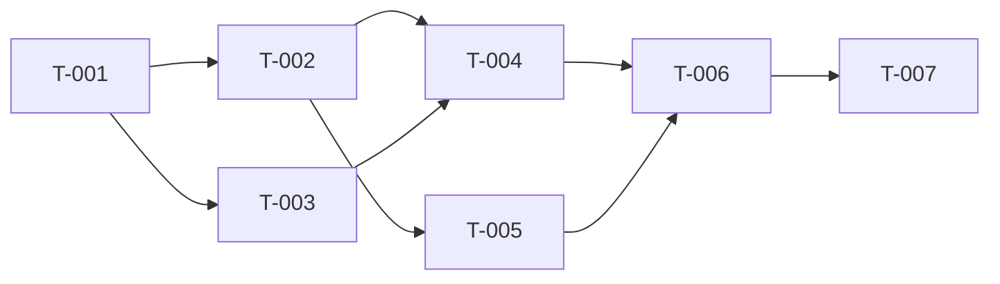

# tasks.md: llm-serving-observability

> **Phase**: 4 (VERIFY)
> **Track**: Feature
> **입력**: docs/design.md

---

## Dependency Graph

## Parallel Groups

| Group | Tasks | 선행 조건 |
|-------|-------|----------|
| G0 | T-001 | - |
| G1 | T-002, T-003 | T-001 완료 |
| G2 | T-004, T-005 | G1 중 해당 의존 태스크 완료 |
| G3 | T-006 | T-004, T-005 완료 |
| G4 | T-007 | T-006 완료 |

---

## Task Table

| Task ID | Description | AC | Depends | Group | Status |
|---------|------------|----|---------|-------|--------|
| T-001 | Docker Compose + Ollama 연동 | AC-001 | - | G0 | Done |
| T-002 | LLM Proxy (FastAPI) 구현 | AC-002 | T-001 | G1 | Done |
| T-003 | Prometheus + Grafana 스택 | AC-003 | T-001 | G1 | Done |
| T-004 | Grafana Dashboard 구현 | AC-004 | T-002, T-003 | G2 | Done |
| T-005 | Load Generator 구현 | AC-005 | T-002 | G2 | Done |
| T-006 | Model Comparison Benchmark | AC-006 | T-004, T-005 | G3 | Partial |
| T-007 | README + Screenshots | AC-007 | T-006 | G4 | Done |

---

## Acceptance Criteria

### AC-001: Docker Compose + Ollama

1. `docker compose up -d` 실행 시 모든 서비스(ollama, proxy, prometheus, grafana) 기동
2. Ollama 헬스체크: `curl http://localhost:11434/` → "Ollama is running"
3. `.env.example` 파일에 `OLLAMA_BASE_URL`, `PROXY_PORT`, `MAX_CONCURRENT_REQUESTS`, `DEFAULT_MODEL`, `LOG_LEVEL` 5개 정의
4. `OLLAMA_BASE_URL=http://host.docker.internal:11434` 설정 시 네이티브 Ollama 연결 확인

**산출물**: `docker-compose.yml`, `.env.example`

### AC-002: LLM Proxy

1. `POST /v1/chat/completions` → Ollama로 프록시, 정상 응답 반환
2. Streaming 모드: SSE 청크가 클라이언트에 실시간 전달
3. Non-streaming 모드: 완전한 JSON 응답 반환
4. `GET /health` → `{"status": "ok", "ollama": "connected"}` 응답
5. `GET /metrics` → Prometheus exposition format으로 11개 메트릭 노출
6. 메트릭 정확성:
   - `llm_ttft_seconds`: 스트리밍 시 첫 content 청크 도착까지 시간 기록
   - `llm_request_duration_seconds`: 요청 시작~완료 전체 시간 기록
   - `llm_tokens_per_second`: `output_tokens / duration` 계산 기록
   - `llm_time_per_output_token_seconds` (TPOT): `duration / output_tokens` 계산 기록
   - `llm_input_tokens_total`, `llm_output_tokens_total`: usage 정보에서 추출
   - `llm_requests_total`: model, status, stream 레이블로 카운트
   - `llm_request_errors_total`: Ollama 에러 시 status_code 레이블로 카운트
   - `llm_active_requests`: 세마포어 내부 요청 수 추적
   - `llm_queue_depth`: 세마포어 대기 요청 수 추적
   - `llm_model_loaded`: Ollama `/api/ps` 응답의 `details.quantization_level`에서 `quantization` 레이블 추출, 모델 로드 상태 반영
7. Histogram 버킷: design.md 3-1에 정의된 커스텀 버킷 사용 (기본 버킷 금지)
8. `MonitoredSemaphore(MAX_CONCURRENT_REQUESTS)` 래퍼 클래스로 동시성 제한 + 대기자 수(`llm_queue_depth`) 추적 동작 확인

**산출물**: `proxy/main.py`, `proxy/metrics.py`, `proxy/config.py`, `proxy/Dockerfile`, `proxy/requirements.txt`

### AC-003: Prometheus + Grafana Stack

1. Prometheus가 proxy:8000/metrics를 15초 간격으로 스크래핑
2. Prometheus UI(`localhost:9090`)에서 `llm_requests_total` 쿼리 가능
3. Grafana(`localhost:3000`)가 Prometheus datasource 자동 프로비저닝
4. Grafana에 "LLM" 폴더 자동 생성, 대시보드 파일 프로비저닝 경로 설정
5. 익명 접근 Admin 권한 (로컬 학습용, GF_AUTH_ANONYMOUS_ENABLED=true)

**산출물**: `prometheus/prometheus.yml`, `grafana/provisioning/datasources/prometheus.yml`, `grafana/provisioning/dashboards/dashboards.yml`, docker-compose.yml 업데이트

### AC-004: Grafana Dashboard

1. `grafana/dashboards/llm-overview.json` 자동 로드
2. Template variable `$model`: `label_values(llm_requests_total, model)` 동작
3. 패널 10개 구성 (design.md 4-2 Layout 준수):
   - Request Rate (stat)
   - Error Rate % (stat + threshold)
   - Active Requests (gauge)
   - Queue Depth (gauge)
   - Request Duration P50/P95/P99 (timeseries)
   - TTFT P50/P95/P99 (timeseries)
   - Tokens Per Second (timeseries)
   - TPOT - Time Per Output Token (timeseries)
   - Input vs Output Tokens Rate (timeseries)
   - Model Info (table)
4. 부하 발생 후 모든 패널에 데이터 표시 (No Data 없음)
5. PromQL 쿼리: design.md 4-3에 정의된 쿼리 사용

**산출물**: `grafana/dashboards/llm-overview.json`

### AC-005: Load Generator

1. Python asyncio + httpx 기반 부하 테스트 스크립트
2. 5가지 시나리오 실행 가능:
   - S1: Baseline (동시 1, 짧은 프롬프트)
   - S2: Concurrency Sweep (1,2,4,8,16 동시 요청)
   - S3: Sustained Load (동시 4, 혼합 프롬프트, 5분 지속)
   - S4: Variable Prompt (동시 4, 프롬프트 길이 50/200/500 토큰)
   - S5: Model Comparison (동시 4, 동일 프롬프트, 모델 전환)
3. 각 시나리오 실행 후 콘솔에 요약 통계 출력 (평균/P50/P95/P99 레이턴시, 평균 TPS, 에러율)
4. CLI 인터페이스: `python run.py --scenario s1 --base-url http://localhost:8000`

**산출물**: `loadtest/run.py`, `loadtest/scenarios.py`, `loadtest/requirements.txt`

### AC-006: Model Comparison Benchmark

1. S5 시나리오로 최소 2개 모델(qwen2.5:7b, qwen2.5:14b) 벤치마크 실행
2. Grafana 대시보드에서 `$model` 변수로 모델별 성능 비교 가능
3. 벤치마크 결과를 `benchmarks/` 디렉토리에 마크다운으로 기록:
   - 모델별 TTFT P50/P95
   - 모델별 TPS 평균
   - 모델별 E2E Duration P50/P95
   - 동시성 증가에 따른 성능 변화 그래프 설명

**산출물**: `benchmarks/results.md`, Grafana 대시보드 스크린샷

### AC-007: README + Screenshots

1. README.md에 프로젝트 목적, 아키텍처 다이어그램, Quick Start 가이드 포함
2. Quick Start: 5단계 이내로 전체 스택 기동 + 부하 테스트 실행 가능
3. Grafana 대시보드 스크린샷 최소 2장 (부하 전/후)
4. 벤치마크 결과 요약 테이블
5. 기술 스택 명시 (Ollama, FastAPI, Prometheus, Grafana, Python asyncio)

**산출물**: `README.md`, `docs/screenshots/`
